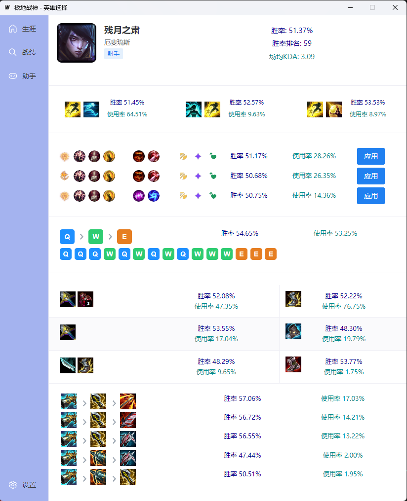

# WARGOD

The God of War in ***League of Legends*** games, It's legitimate game assistant.

### 预期核心功能

> 启动切换备战席英雄过于逆天(秒切换, 无保护CD), 可能影响队友关系，目前禁用掉

- [ ] 自动游戏登录
- [ ] 修改生涯背景
- [x] 修改段位和状态[仅聊天栏好友可见]
- [ ] 战绩查询 / 分析
- [x] 自动续盘
- [x] 自动接受对局
- [x] 选择英雄事件 -> opgg -> 符文导入 -> 出装、技能
- [x] 大乱斗自定义英雄优先级(通过摇骰子/备战席，自动选择英雄)
- [ ] 排位根据位置自动BAN英雄、选英雄

### 技术开发项

1. 游戏进程发现，后台提权
2. 状态机定义
3. 游戏客户端keepalive检测
4. LCU接口模型定义
5. websocket监听游戏事件
6. 处理游戏事件
7. 三方数据采集(*短期数据缓存*)

### 备注：

项目处于初始阶段，感兴趣的可以一起参与

- 前端vue3 typescript
- 后端golang wails

### 参考：

1. lcu-api文档: [lcu-schema](https://www.mingweisamuel.com/lcu-schema/tool/#/Plugin%20lol-chat/PutLolChatV1Me)
2. 不错的项目, 可以作为目标: [Seraphine](https://github.com/Zzaphkiel/Seraphine)

### 目标:

1. 功能完整
2. 性能，兼顾轻量
3. 代码可读
4. 跨平台
